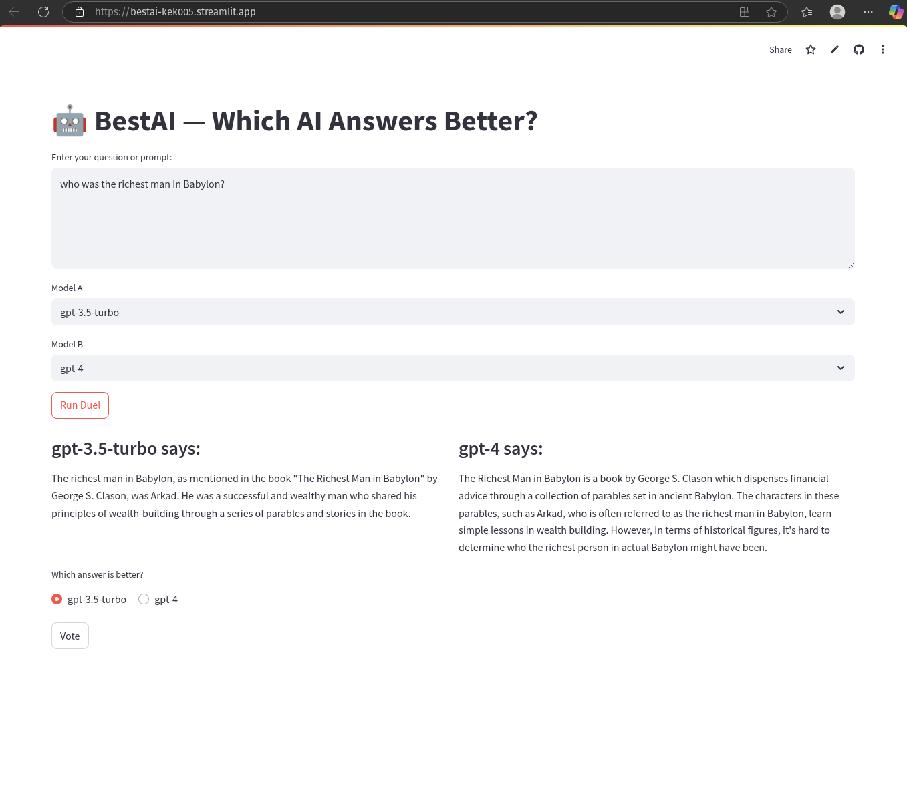

# 🤖 BestAI – Which AI Answers Better?

**BestAI** is an interactive web app built with Streamlit that lets users compare answers from two different large language models (LLMs) like GPT-3.5 and GPT-4 — side-by-side. Users can enter any question, view both model outputs, and vote for the better answer.

### 🌟 Live Demo
👉 [Click here to try LLM Duel](https://llm-duel.streamlit.app) # to be replaced by the actual url

---

## 🚀 Features

- Compare any two OpenAI models on a single prompt
- Side-by-side UI for clear visual comparison
- One-click voting for best output
- Clean and fast Streamlit UI
- 🔒 API key stored securely via `.env`
- Fast to use, easy to extend

---

## 📸 Screenshot



---

## 🛠 Tech Stack

- [Streamlit](https://streamlit.io/) – UI framework
- [OpenAI Python SDK (v1.x)](https://github.com/openai/openai-python) – LLM interaction
- [Python 3.10+](https://www.python.org/) – Backend logic

---

## 📦 Setup Instructions

### 1. Clone the Repo
```bash
git clone https://github.com/yourusername/bestAI.git
cd bestAI

2. Create & Fill in .env
cp .env.template .env


Add your OpenAI key in .env:
OPENAI_DUEL_KEY=sk-your-api-key-here


3. Install Dependencies
pip install -r requirements.txt


4. Run the App Locally
streamlit run app.py


📁 File Structure
bestAI/
├── app.py                # Main Streamlit UI
├── llm_wrappers.py       # Model calling logic
├── prompts.py            #  prompt templates
├── utils.py              # tools/logging
├── requirements.txt      # Install dependencies
├── .env.template         # Example env for API key
├── .gitignore            # Hides your .env and other files
└── README.md             # This file


🔒 Safety & Limits
Your OpenAI key is securely stored using .env

Add per-session or per-user usage limits using st.session_state

You can also configure billing limits in the OpenAI dashboard


📈 Future Features (Planned)
Claude and Mistral model support

CSV vote logging and analytics dashboard

Prompt templates (persona, tone, format)

PDF upload and summary comparison (RAG support)


---


## 📬 Contact

Built with 💡 by Jesugnon KEKE  
📧 ancetreseul@gmail.com | jesugnon2014@gmail.com  
📞 +1 (215) 600-4237  

✅ Open to collaborations, jobs, feedback, and partnerships!